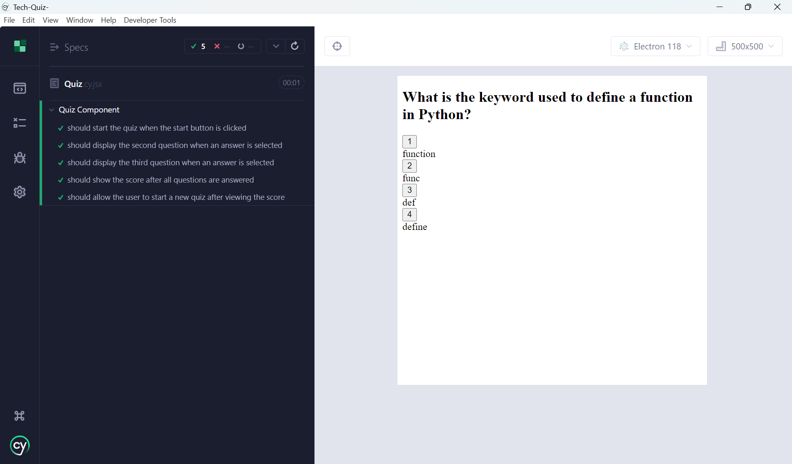

# Tech Quiz


## User Story
AS AN aspiring developer
I WANT to take a tech quiz
SO THAT I can test my knowledge and improve my skills


## Description
Tech Quiz is a web application that allows users to take quizzes on various technical topics. The application is built using the MERN stack (MongoDB, Express, React, Node.js) and TypeScript.

## Features

- Randomly generated quiz questions
- Score tracking
- Responsive design
- Easy to extend with new questions

## Project Structure

```
.
├── client
│   ├── public
│   ├── src
│   │   ├── assets
│   │   ├── components
│   │   ├── models
│   │   ├── services
│   │   ├── App.css
│   │   ├── App.tsx
│   │   ├── main.tsx
│   ├── .eslintrc.cjs
│   ├── index.html
│   ├── package.json
│   ├── tsconfig.json
│   ├── vite.config.ts
├── cypress
│   ├── component
│   ├── e2e
│   ├── fixtures
│   ├── support
│   ├── tsconfig.json
│   ├── cypress.config.ts
├── server
│   ├── src
│   │   ├── config
│   │   ├── controllers
│   │   ├── models
│   │   ├── routes
│   │   ├── seeds
│   │   ├── server.ts
│   ├── package.json
│   ├── tsconfig.json
├── .gitignore
├── .npmrc
├── LICENSE
├── package.json
├── tsconfig.json
└── README.md
```

## Installation

1. Clone the repository:
   ```sh
   git clone https://github.com/yourusername/tech-quiz.git
   cd tech-quiz
   ```

2. Install dependencies:
   ```sh
   npm run install
   ```

3. Set up environment variables:
   Create a `.env` file in the server directory with the following content:
   ```env
   MONGODB_URI=your_mongodb_uri
   ```

## Usage

1. Start the development server:
   ```sh
   npm run start:dev
   ```

2. Open your browser and navigate to `http://localhost:3001`.

## Running Tests

To run Cypress tests, use the following command:
```sh
npm run cy
```

## Building for Production

To build the project for production, run:
```sh
npm run build
```

## License

This project is licensed under the MIT License. 

## Demo
https://drive.google.com/file/d/1qVnPHZYoXwCVwzvdZj7DCDkd8ioBfhh0/view?usp=sharing

