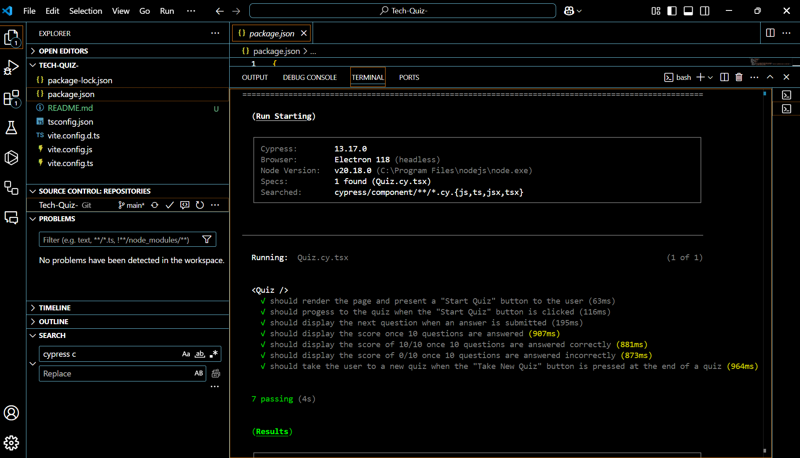
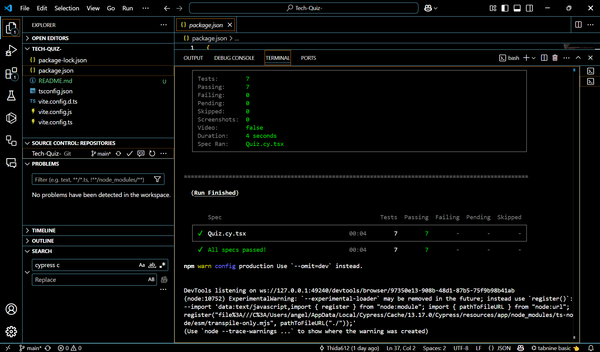
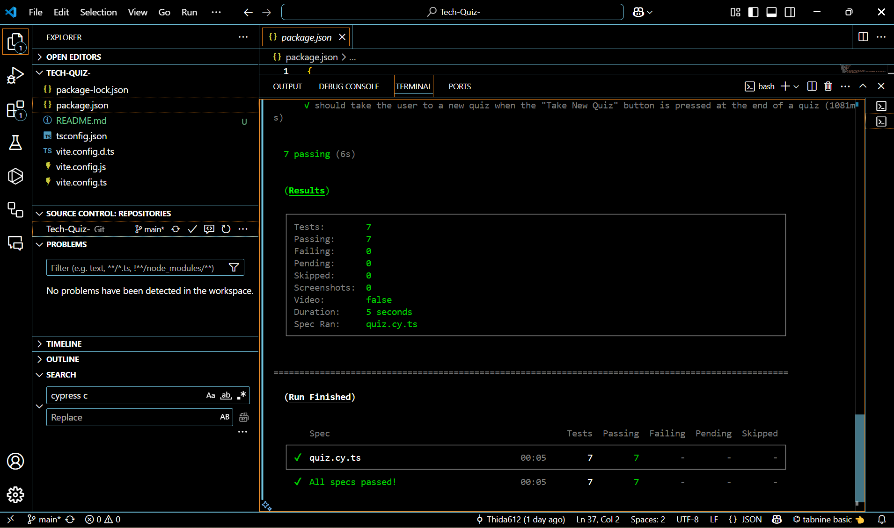
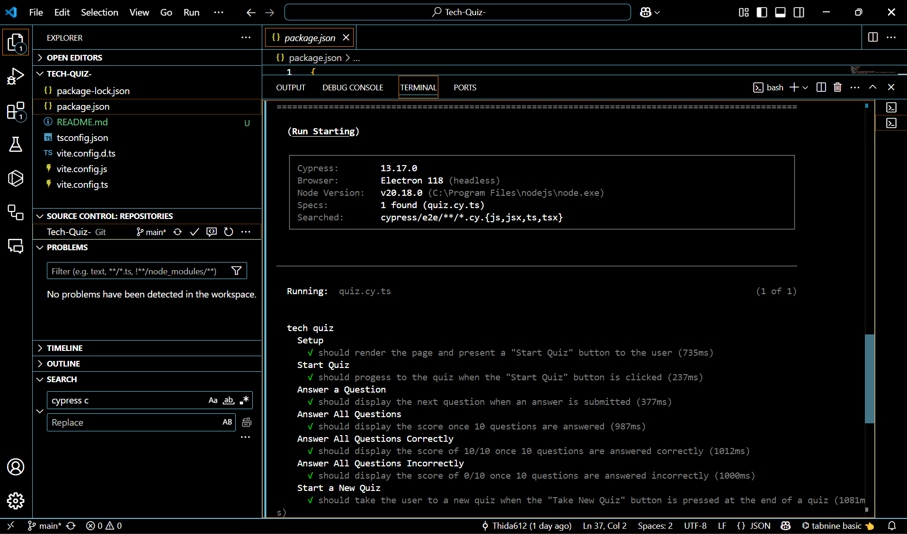
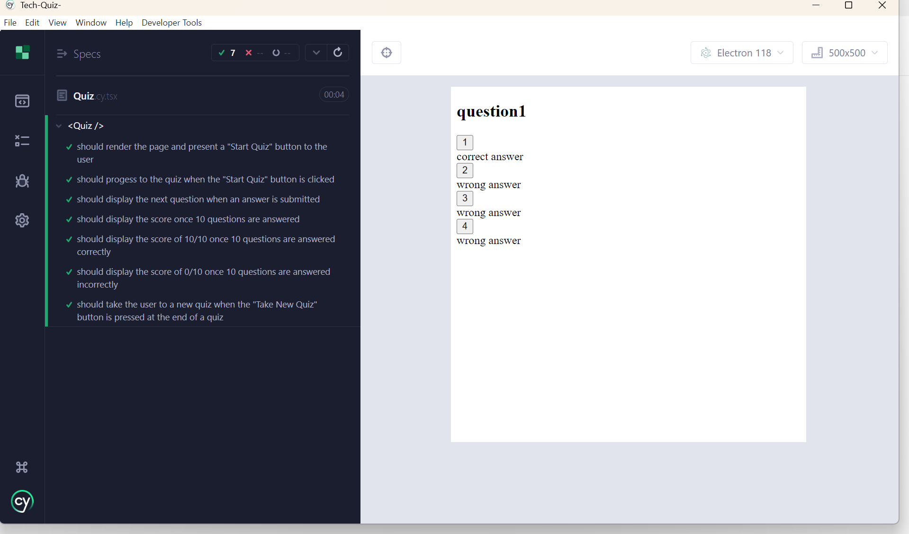
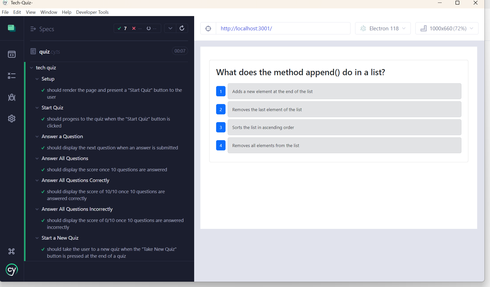

# Tech-Quiz

[](https://opensource.org/licenses/MIT)


## Description 
Tech-Quiz is an interactive quiz application that allows aspiring developers to test and expand their tech knowledge. Built with **TypeScript**, **Node.js**, and **MongoDB**, this project provides a streamlined, responsive experience for users to challenge themselves and track their scores.

## User Story
AS AN aspiring developer<br>
I WANT to take a tech quiz<br>
SO THAT I can test my knowledge and improve my skills


## Table of Contents

- [Installation](#installation)
- [Usage](#usage)
- [Contributing](#contributing)
- [Tests](#tests)
- [Questions](#questions)
- [License](#license)

---

## Installation

To install and run the application locally, follow these steps:

1. **Clone the repository**:

   ```bash
   git clone https://github.com/Thida612/Tech-Quiz-CM.git
   cd Tech-Quiz-
   ```

2. **Install dependencies**:

   ```bash
   npm install
   ```

3. **Configure environment variables**:

   Create a `.env` file in the root directory and configure it with your system-specific variables (e.g., MongoDB connection string).

4. **Build the TypeScript code**:

   ```bash
   npm run build
   ```

5. **Seed the MongoDB database**:

   ```bash
   npm run seed
   ```

---

## Usage

To start the application:

1. Run the server:

   ```bash
   npm run start:dev
   ```

2. Open your browser and follow the on-screen prompts to begin the quiz and test your tech knowledge.

---

## Contributing

Interested in contributing? Contributions are welcome! Please reach out to **Thida Johnson** with any inquiries:

- **Email**: [thidaJohnson7@gmail.com](mailto:thidaJohnson7@gmail.com)

---

## Tests

To ensure the application is functioning as expected, you can run the test suite:

1. **Execute automated tests**:

   ```bash
   npm run test
   ```

2. **Launch Cypress GUI for manual/visual testing**:

   ```bash
   npm run cypress
   ```

## Demo

[Watch The Demo Video](https://drive.google.com/file/d/1hHQEJqsk0GDle_8CS14aoP0UoKewjudj/view?usp=sharing)<br><br>

<br><br>
<br><br>
<br><br>
<br><br>
<br><br>



---

## Questions

If you have any questions about the project, feel free to reach out:

- **GitHub**: [Thida612](https://github.com/Thida612)
- **Email**: [thidajohnson7@gmail.com](mailto:thidajohnson7@gmail.com)

---

## License

This project is licensed under the MIT License. 